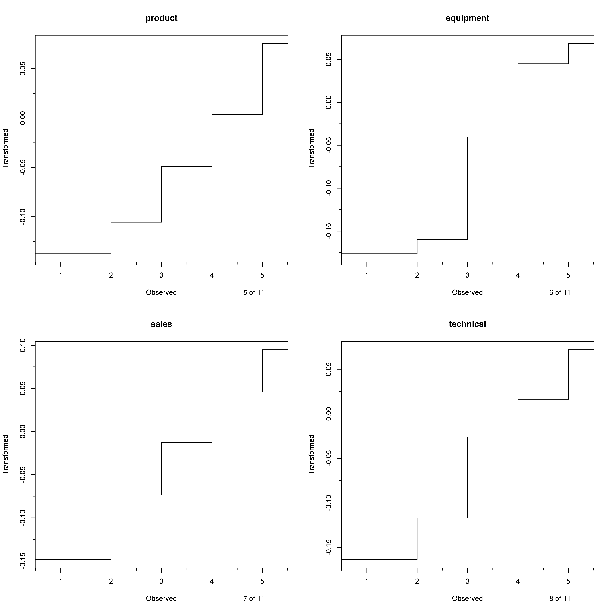
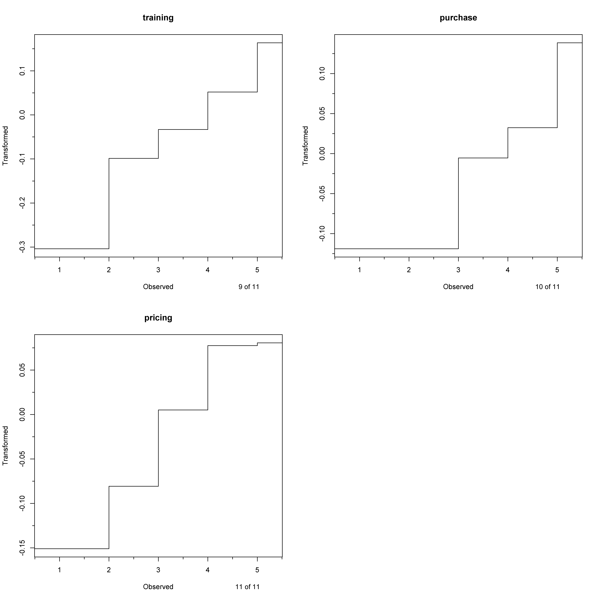
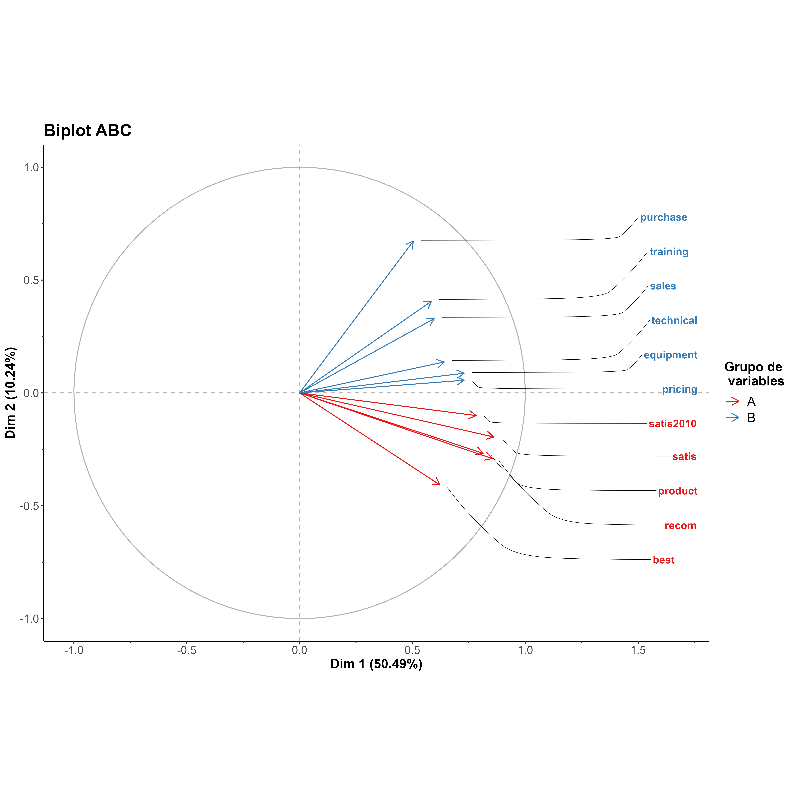

---
output:
  html_document: default
  pdf_document: default
---
# g.princals

It´s R-script to improve aesthetic plotting of princals function of Gifi package

## Contents
- [Proposal](#proposal)
- [Instruction](#instruction)
- [R code](#r-code)
- [Output](#output)
- [Reference](#reference)

## Proposal 

g.princals is a function designed to address aesthetic issues encountered when using plot.princals of "Gifi" package[(1)](#reference), which exclusively generates plots using a "graphic" package. g.princals leverages the power of the ggplot2 package, renowned for producing high-quality visuals.this function just produce, transplot, scree plot, loadplot and biplot for hierarchical categoric variables[(2)](#reference).


## Instruction

"g.princals" replaces the default "plot" function in R, generating customized graphics for customer items.
  - x: call a object was generated by princals(dataset).
  - plot.dim:  Vector with dimensions to be plotted with the default condition being set to c(1, 2).
  - var.subset: with the default condition being set to"all"
  - max.plot.array: with the default condition being set to 2.
  - stepvec: Vector whether step function should be plotted (see details in princals/R Documentation).with the default condition being set to NA.
  - col.lines: colour of line. Default condition being set to "black".
  - main: Title of picture. Default condition being set to name of princals object.
  - show: Options to choose are TRUE,FALSE,T,F,1 and 0. Default condition being set to "1" mean it shows plots.
  - save: Options to choose are TRUE,FALSE,T,F,1 and 0. Default condition being set to "1" mean it saves plots.
  - name: label or name of princals object. Default condition being set to name of princals object. 
  - units: unit of width/height in 'mm'
  - width: Default condition being set to 250mm.
  - height: Default condition being set to 250mm. 
  - res: resolution of pictures. Default condition being set to 300 pixels.
  
## R code

Finally, it were showed a picture which generated by "g.princals".
```markdown
################################################################################
setwd("~/file")
source("https://github.com/jasb3110/g.princals/blob/f286b26f79da57600c3e7f207a6f653f24028a76/g.princals.R)
ABC6 <- ABC[,6:11]
fitord <- princals(ABC6,ndim = 6)  
g.princals(fitord,save=0,show=1)#show plots
g.princals(fitord,save=1,show=0)#save plots in PNG format
################################################################################
```
## Output
In this section, an R script and corresponding plots created using the g.princals function are presented.

|[](https://github.com/jasb3110/g.princals/blob/6c05b350f10a0e56130864eb4b018dcf658da2a9/ABC.transplot.1.png?raw=true)|
|:--:| 
|*Picture. Transplots of ABC dataset, just 1 to 4 variables*|

|[](https://github.com/jasb3110/g.princals/blob/6c05b350f10a0e56130864eb4b018dcf658da2a9/ABC.transplot.2.png?raw=true)|
|:--:| 
|*Picture. Transplots of ABC dataset, just 5 to 8 variables*|

|[](https://github.com/jasb3110/g.princals/blob/6c05b350f10a0e56130864eb4b018dcf658da2a9/ABC.transplot.3.png?raw=true)|
|:--:| 
|*Picture. Transplots of ABC dataset, just 9 to 11 variables*|

|[](https://github.com/jasb3110/g.princals/blob/6c05b350f10a0e56130864eb4b018dcf658da2a9/ABC.screeplot.png?raw=true)|
|:--:| 
|*Picture. Screeplot of ABC dataset*|

|[](https://github.com/jasb3110/g.princals/blob/6c05b350f10a0e56130864eb4b018dcf658da2a9/ABC.loadplot.png?raw=true)|
|:--:| 
|*Picture. Loadplot of ABC dataset*|

|[](https://github.com/jasb3110/g.princals/blob/6c05b350f10a0e56130864eb4b018dcf658da2a9/ABC.biplot.png?raw=true)|
|:--:| 
|*Picture. Biplot of ABC dataset*|

## Reference

  - https://rdrr.io/rforge/Gifi/src/R/plot.princals.R
  - https://github.com/jasb3110/g.princals/blob/7d6bcd378248de201963f0413eee7c232bb2f753/g.princals.R
