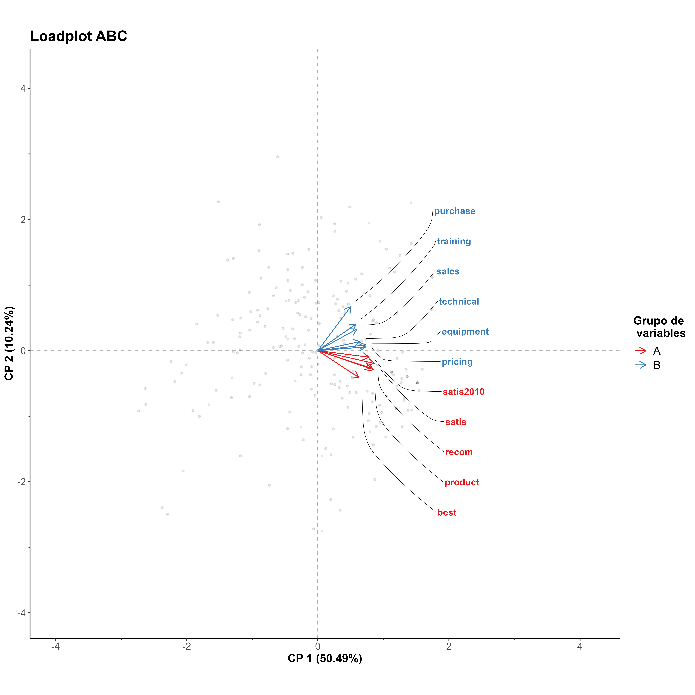

---
output:
  pdf_document: default
  html_document: default
---
# $g.princals$

This script provides a way to enhance the appearance of plots created with the PRINCALS function from the Gifi package in R [(1)](#references) using source code of plot function in Gifi package.
Since PRINCALS generates complex outputs that require additional processing for effective visualization.
Script uses ggplot2 [(2)](#references) to improve the aesthetic and clarity of the results.

## Contents
- [Proposal](#proposal)
- [Instruction](#instruction)
- [R code](#r-code)
- [Output](#output)
- [References](#references)

## Proposal 

The g.princals function is specifically designed to improve the aesthetics of plots generated by the plot.princals function from the Gifi package, which by default relies on the base R graphics package for visualizations [(3)](#references).
By harnessing the powerful capabilities of ggplot2, a package renowned for producing high-quality, customizable graphics, g.princals offers a more polished and visually appealing experience. 
This function provides options to create various plots, including transformed plots, scree plots, loading plots, and biplots for hierarchical categorical variables [(4)](#references).

## Instruction

The g.princals function overrides the default plot function in R to generate customized graphics for objects created by the princals function. Below are the available parameters and their default settings:

- x: An object generated by princals(dataset).
- plot.dim: A numeric vector specifying the dimensions to be plotted. Default is c(1, 2).
- var.subset: Specifies a subset of variables to include. Default is "all".
- max.plot.array: Maximum number of plots per array. Default is 2.
- stepvec: A numeric vector indicating whether to include a step function in the plot (see princals documentation for details). Default is NA.
- col.lines: Color of the lines in the plot. Default is "black".
- main: Title of the plot. By default, it uses the name of the princals object.
- show: Logical or numeric (TRUE/FALSE, T/F, 1/0) indicating whether to display the plots. Default is 1 (TRUE).
- save: Logical or numeric (TRUE/FALSE, T/F, 1/0) indicating whether to save the plots. Default is 1 (TRUE).
- name: A label or name for the princals object. Default is the name of the object.
- units: Units for width and height. Default is "mm".
- width]: Width of the output image. Default is 250mm.
- height: Height of the output image. Default is 250mm.
- res: Resolution of the image in pixels. Default is 300.
- dispersion: Controls the spread of scores in the load plot. Default is 3, which corresponds to mean ± 3 * standard deviation.
- point.size.loadplot: Size of the points in the load plot. Default is 1.
- point.alpha.loadplot: Transparency level (alpha) of the points in the load plot. Default is 0.1.
- language: Language for the plot labels. Options are "English" or "Spanish". Default is "English".
- legend.position: Position of the legend. Options are "none", "left", "right", "bottom", and "top". Default is "right".
- legend.group: Logical or numeric (TRUE/FALSE, T/F, 1/0) indicating whether to display grouped legends. Default is 1 (TRUE).

## R code

Finally, it were showed a picture which generated by "g.princals". If the label names are lengthy, it's advisable to shorten them into acronyms.

```markdown

#to begin

library("Gifi")
setwd("~/file")
source(
"https://github.com/jasb3110/g.princals/blob/f286b26f79da57600c3e7f207a6f653f24028a76/g.princals.R"
)

# ordinal PCA
fitord <- princals(ABC,ndim = 2)## ordinal PCA
g.princals(fitord,save=0,show=1,
                  dispersion =3,
                  legend.group = 0)#show plots
                  
g.princals(fitord,save=0,show=1,
                  dispersion =3,
                  colour.group = c(rep("A",5),rep("B",6)),
                  legend.group = 1,
                  language = "spanish")#show plots

g.princals(fitord,save=1,show=1,
           dispersion =3,legend.group = 0)#save plots in PNG format
g.princals(fitord,save=1,show=0,
           dispersion =3,colour.group = c(rep("A",5),rep("B",6)),
           legend.group = 1,language = "spanish")#save plots in PNG format

```
## Output
In this section, an R script and corresponding plots created using the g.princals function are presented in Spanish, and group of variables.

|[](https://github.com/jasb3110/g.princals/blob/fb5dbc28c4a2e9677e6952ddd5b2dc2350b8ebf7/ABC.transplot.1.png?raw=true)|
|:--:| 
|*Picture. Transplots of ABC dataset, just 1 to 4 variables*|

|[](https://github.com/jasb3110/g.princals/blob/fb5dbc28c4a2e9677e6952ddd5b2dc2350b8ebf7/ABC.transplot.2.png?raw=true)|
|:--:| 
|*Picture. Transplots of ABC dataset, just 5 to 8 variables*|

|[](https://github.com/jasb3110/g.princals/blob/fb5dbc28c4a2e9677e6952ddd5b2dc2350b8ebf7/ABC.transplot.3.png?raw=true)|
|:--:| 
|*Picture. Transplots of ABC dataset, just 9 to 11 variables*|

|[](https://github.com/jasb3110/g.princals/blob/fb5dbc28c4a2e9677e6952ddd5b2dc2350b8ebf7/ABC.screeplot.png?raw=true)|
|:--:| 
|*Picture. Screeplot of ABC dataset*|

|[](https://github.com/jasb3110/g.princals/blob/fb5dbc28c4a2e9677e6952ddd5b2dc2350b8ebf7/ABC.loadplot.png?raw=true)|
|:--:| 
|*Picture. Loadplot of ABC dataset*|

|[](https://github.com/jasb3110/g.princals/blob/fb5dbc28c4a2e9677e6952ddd5b2dc2350b8ebf7/ABC.biplot.png?raw=true)|
|:--:| 
|*Picture. Biplot of ABC dataset*|

## References
   
- [(1)](https://cran.r-project.org/web/packages/Gifi/index.html) https://cran.r-project.org/web/packages/Gifi/index.html
- [(2)](https://ggplot2.tidyverse.org/) https://ggplot2.tidyverse.org/
- [(3)](https://rdrr.io/rforge/Gifi/src/R/plot.princals.R) https://rdrr.io/rforge/Gifi/src/R/plot.princals.R
- [(4)](https://github.com/jasb3110/g.princals/blob/0ed7b04adcb1039de5f9cafca0c6315a36a37e09/g.princals.R) https://github.com/jasb3110/g.princals/blob/0ed7b04adcb1039de5f9cafca0c6315a36a37e09/g.princals.R
  
  